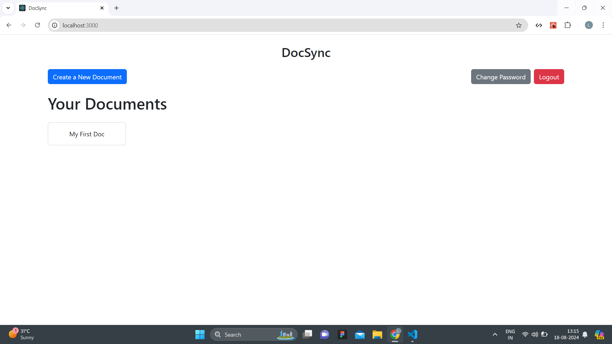

# DocSync

DocSync is a collaborative document editing tool designed to enable multiple users to work on documents simultaneously. Built using React, Mongoose, Socket.io, and Quill, DocSync provides real-time synchronization and editing features akin to Google Docs.



## Features

- **Real-time Collaboration**: Edit documents together with other users in real-time.
- **Version Control**: Automatically save document changes at regular intervals of 2 seconds.
- **Rich Text Formatting**: Utilize a wide range of formatting options with Quill, including headings, lists, and more.
- **Document Management**: Create, access, and manage documents using unique IDs.
- **User Authentication**: Includes signup, login, and logout functionalities.
- **Password Management**: Change passwords and reset forgotten passwords.
- **Document Sharing**: Share documents with other users via email invitations.
- **Document Renaming**: Easily rename documents from the user interface.

## Technologies Used

- **Frontend**: React.js, Quill
- **Backend**: Node.js, Express.js, Socket.io
- **Database**: MongoDB, Mongoose

## Installation

### Prerequisites

- Node.js
- npm or yarn
- MongoDB (local or cloud-based)

### Setup

1. **Clone the Repository**

   ```sh
   git clone https://github.com/LavanyaSingla/DocSync.git
   cd DocSync


2. **Install Dependencies**

    For the server:

    ```sh
    cd server
    npm install
    ```

   For the client:

    ```sh
    cd ../client
    npm install


3. **Create a .env file in the server directory with the following content:**

    env
    MONGO_URI=mongodb://localhost:27017/DocSync

4. **Start the Server**

    ```sh
    cd server
    npm run start

5. **Start the Client**

    ```sh
    cd client
    npm run start

## Screenshots


## Usage
1. Access the Application: Open http://localhost:3000 in your browser.
2. Authenticate: Use the signup or login pages to access the application.
3. Create and Edit Documents: Start new documents or edit existing ones in real-time.
4. Manage Documents: Share, rename, and manage your documents from the user interface.

## Contributing
Feel free to open issues or submit pull requests to contribute to the development of DocSync.
